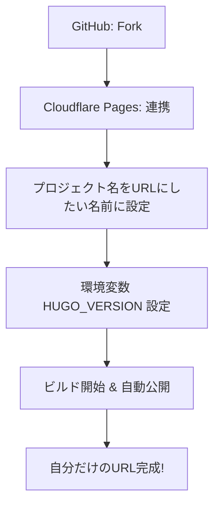
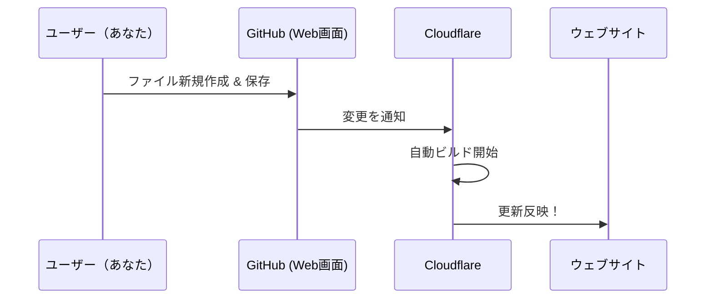

# my-simple-diary (Hugo版プラットフォーム)

このリポジトリは、**Hugo + Markdown** を活用した、シンプルで美しい日記・ポートフォリオサイトのテンプレートです。
技術的な知識がなくても、GitHub のブラウザ画面上でファイルを操作するだけで、自分専用の本格的なサイトを公開・運営できます。

---

## 🎨 このサイトの仕組み（ノートと掲示板のたとえ）

「GitHub（ギットハブ）とか Cloudflare（クラウドフレア）って何？」という方も、以下のイメージを持っていれば大丈夫です！

> **1. GitHub（ギットハブ）＝「秘密のノート」**
> あなたが日記を書き、下書きを保存しておく「ノート」や「物置」のような場所です。
>
> **2. Cloudflare（クラウドフレア）＝「ピカピカの掲示板」**
> ノートの中身を読み取って、世界中の人が見られるように「綺麗に貼り出してくれる」掲示板の役割です。
>
> **✨ 魔法の連携：**
> あなたがノート（GitHub）に日記を書いて保存ボタンを押すと、掲示板（Cloudflare）がそれを察知して、**自動的に**最新のサイトに書き換えてくれます！

つまり、あなたは **「ノートに日記を書くこと」** だけに集中すれば、あとの難しいことはAIとシステムが勝手にやってくれます！

---

## 🚀 始め方（一歩ずつ進めるガイド）

技術的な知識がない方でも、以下のステップを順番に進めれば、約10分ほどで自分専用の美しいサイトが立ち上がります。

### Step 1: 自分専用の「ノート」を作る (Fork)

まずは、このテンプレートを自分の GitHub アカウントにコピーします。

1. この画面の右上にある **「Fork」** ボタン（🍴 マーク）をクリック。
2. 画面の指示に従い、 **「Create fork」** をクリック。
3. これで、あなたのアカウントの中に自分専用の「ノート（リポジトリ）」ができました！

### Step 2: インターネットの「掲示板」に貼り出す (Cloudflare)

次に、コピーしたリポジトリをインターネットに公開する設定を行います。

1. [Cloudflare ダッシュボード](https://dash.cloudflare.com/) にログインします。
2. 左メニューの **「Compute (Workers)」** ＞ **「Workers & Pages」** を開きます。
3. 右上の **「作成 (Create)」**（または **「アプリケーションを作成する」**）ボタンをクリックします。
4. **【重要！】** 次の画面は Workers 用の設定に見えますが、画面を一番下までスクロールすると、中央付近に小さな文字で **「Pages をデプロイしますか？ 開始する (Looking to deploy Pages? Get started)」** というリンクがあるので、これをクリックします。
5. **「Pages」** ＞ **「Git に接続」** ＞ **「リポジトリを接続」** ボタンをクリックします。
6. 自分の GitHub アカウントを連携し、先ほどコピーした `my-simple-diary` を選択して **「セットアップの開始」** をクリックします。
7. **ビルド設定** で以下を正確に入力します：
    - **フレームワークプリセット**: `Hugo`
    - **ビルドコマンド**: `hugo -b $CF_PAGES_URL`
    - **ビルド出力ディレクトリ**: `public`
8. **プロジェクト名の設定（重要！）**:
    - ここで入力するプロジェクト名が、そのまま `プロジェクト名.pages.dev` という URL になります。
    - 例: `myouji-namae` と入力すれば、URL は `https://myouji-namae.pages.dev/` になります。
    - **注意**: 一度作成するとプロジェクト名は後から変更できません。変更したい場合は、一度削除して作り直す必要があります。
9. **環境変数** を追加します（ここを忘れるとエラーになります）：
    - 左メニューの **「設定」 (Settings)** ＞ **「変数とシークレット」 (Variables and Secrets)** を開きます。
    - **「変数を追加する」** をクリックし、以下を入力します：
        - **変数名**: `HUGO_VERSION` / **値**: `0.146.6`
10. **「保存してデプロイ」** をクリックします。数分後、公開用の URL（`*.pages.dev`）が表示されます！



> [!IMPORTANT]  
> **プロジェクト名の設定に関する注意**  
> Cloudflare Pages では、ここで入力する「プロジェクト名」がそのままサイトのアドレス（`プロジェクト名.pages.dev`）になります。後から名前を変えることは難しいため、慎重に決めてください。もし後から変更したい場合は、**一度プロジェクトを削除して作り直すのが最も確実かつ迅速な方法**です。

### 🌐 アドレス（URL）を好きな名前にするには？

Cloudflare Pages では、**「プロジェクト名」** がそのままサイトのアドレスになります。
- 好きな名前（例：`myouji-namae`）にしたい場合は、Step 2 の作成画面でプロジェクト名をそのように入力してください。
- **もっとこだわりたい場合**: 自分で取得した独自ドメイン（例：`example.com`）を割り当てることも可能です。デプロイ完了後、Cloudflare の「カスタムドメイン」設定から行えます。

### Step 3: 自分専用に書き換える (Personalize)

サイトの名前や自分の名前を設定します。

1. 自分のリポジトリの `hugo.toml` を開きます。
2. 右上の **鉛筆マーク（Edit）** を押して編集を開始します。
3. 以下の箇所を書き換えて、画面下の **「Commit changes」** で保存します。

```toml
title = "（ここにサイトのタイトルを書く）"

[author]
  name = "（あなたの名前）"

[params]
  authorName = "（表示される名前）"
  description = "（タイトル下に表示される説明文）"
  githubUser = "（あなたのGitHubユーザー名）"
```

> [!TIP]
> **タイトル下の説明文を変更するには？**: `hugo.toml` の `description = "..."` の部分を書き換えるだけで、サイトの印象をガラッと変えることができます。

---

## 🦋 BlueSky への自動投稿（オプション）

日記を新しく公開した時に、自動的に BlueSky に通知を送ることができます。

1. GitHub のリポジトリ画面で **[Settings]** ＞ **[Secrets and variables]** ＞ **[Actions]** を開きます。
2. **[New repository secret]** をクリックして、以下の 2 つを登録します。
    - **Name**: `BLUESKY_IDENTIFIER` / **Value**: あなたのハンドル名（例: `xxx.bsky.social`）
    - **Name**: `BLUESKY_PASSWORD` / **Value**: BlueSky の「アプリパスワード」
3. これで、`main` ブランチに新しい日記を追加するたびに、BlueSky へ自動投稿されます。

---

## ✍️ 日記の書き方（運用フロー）

専門的な知識は不要です。ブラウザだけで完結します。

1. `content/diary/` フォルダを開きます。
2. **[Add file]** ＞ **「Create new file」** をクリック。
3. ファイル名を `2026-04-01.md`（今日の日付.md）にします。
4. 編集画面（白いエリア）に、以下の **テンプレート** をコピーして貼り付けます。
5. 内容（タイトル、日付、本文など）を書き換え、画面右上の **「Commit changes...」** をクリックして保存します。

### 📋 コピーして使うテンプレート
ファイルの一番上にある `---` で囲まれた部分は、サイト内での表示（タイトルや日付）を決めるための「設定」です。ここを消すとエラーになるので、必ず残してください。

```markdown
---
title: "今日の日記"
date: 2026-04-03T08:00:00+09:00
draft: false
---

ここに自由に文章を書けばOK！
```

**最重要　段落を変える**
  - **新しい段落にする**: `Enter` を **2回** 押して、一行あけます（これで文章の間に隙間ができて読みやすくなります）。
  - **普通に改行する**: 文の最後で `Enter` を **1回** 押します。

### 💡 記号の意味と書き方のコツ
「この記号は何？」「どこまで書けばいいの？」という時のためのガイドです。

####　1. 書き方の例

```markdown
---
title: "2026-04-03 の日記"
date: 2026-04-03T00:00:00+09:00
draft: false
---

# 今日のひとこと（概要/タグなど）
#日記 #今日のできごと

## 本文
ここに日記の内容を自由に書きます。
```

#### 2. 文章を飾る「便利な道具（記号）」
「SNSっぽく見せたいな」「文字を大きくしたいな」と思った時に使う、便利な記号（Markdown）です。

- **文字を大きくする（見出し）**
  - `# ` (ハッシュの後にスペース): 一番大きい文字になります（章のタイトルなど）
  - `## ` (ハッシュ2つの後にスペース): 中くらいの大きさになります（節のタイトルなど）
  - ※ 記号の後に **必ず半角スペース** を入れるのがコツです！
- **文字を太くする（強調）**
  - `**文章**` (星2つで囲む): **こんな風に太く強調されます**
- **タグっぽく見せる**
  - `#日記` (ハッシュの直後に文字): SNSのハッシュタグのように表示され、このデザインで自動的に色がつくようになっています。

> [!TIP]  
> これら以外にも、リンクを貼ったり画像を載せたりする方法がもっとあります。「**マークダウン 書き方**」で検索すると、たくさんの便利な使い方が見つかりますよ！



---

## 🧐 困ったときは (Troubleshooting)

今日の移転作業や構築でよくある「つまずきポイント」の解決策です。

### Q: URL（*.pages.dev）にアクセスしてもエラーが出る
- **反映待ち**: Cloudflare でプロジェクトを作成・変更した直後は、DNS（住所録）が世界中に広まるまで **数分〜数十分** かかることがあります。少し待ってから再度アクセスしてください。
- **キャッシュ**: ブラウザが古い情報を覚えている場合があります。「シークレットモード」で開くか、ブラウザのキャッシュをクリアしてみてください。

### Q: GitHub で名前を変えたのに、Cloudflare の表示が古いまま
- **リポジトリの再接続手順**:
  1. Cloudflare のプロジェクト画面で **「設定」 (Settings)** タブをクリック。
  2. 左メニューの **「ビルド & デプロイ」 (Builds & deployments)** を開く。
  3. 中央の **「リポジトリの管理」** または **「管理」 (Manage)** ボタンをクリック。
  4. GitHub の画面が別ウィンドウで開くので、新しいリポジトリ名を選択して **[Save]**。
  5. Cloudflare 側で最新のリポジトリが掴み直されます。
- **解決しない場合**: 「一度削除して新しく作り直す」のが一番スッキリ解決する近道です。

### Q: プロジェクト名を後から変えたい
- **場所**: **「設定」 (Settings)** ＞ **「一般」 (General)** ＞ **「名前」** の項目にある **「名前変更」** ボタンから変更できます。
- **注意**: 名前を変えると `*.pages.dev` の URL も変わります。古い URL は使えなくなるので注意してください。

---

## 🌟 上級者向け：テンプレートの同期運用 (Parent-Child Sync)

「テンプレートを最新に保ちつつ、自分だけの日記も書きたい」という方向けの管理方法です。

1. **2つのフォルダを作る**: `template` (型) と `my-site` (自分用) を用意します。
2. **親子関係を作る**: 自分用フォルダで `git remote add upstream ../template` を実行します。
3. **同期する**: テンプレートのデザインを直したら、自分用フォルダで `git pull upstream main` を実行するだけで、日記を消さずにデザインだけを最新にできます。

---

---

## 🛠 技術的な仕組み

- **Hugo**: 世界最速レベルの静的サイト生成ツール。
- **Vanilla CSS**: `static/style.css` で全てのデザインを管理。
- **生HTML対応**: `hugo.toml` の `unsafe = true` により、Markdown 内に HTML タグ（`<p>` や ``）を直接埋め込むことも可能です。

---

## 💰 記事の有料化 (codoc)

## 💰 有料記事（Codoc）の設定方法

この日記システムでは、Codoc（コードク）を使って記事の販売が可能です。

#### 1. Codocで記事を作成する
1.  [Codoc 管理画面](https://codoc.jp/me/entries)で「記事作成」をクリック。
2.  **「無料部分」** には「この記事は有料です」などの短い案内文や、日記のイントロを。
3.  **「有料部分」** には、**日記の本編（隠したい内容）** を書いてください。
4.  価格を設定して「公開」します。
5.  作成した記事の編集画面や一覧から、**「記事コード（ID）」**（例: `jB9Md1saEw`）をコピーします。

#### 2. 日記（GitHub）に貼り付ける
日記のファイル（`.md`）に以下の2行を貼り付けます（Codocのほうに書いた「無料部分」の内容をGitHub側に書く必要はありません。ショートコードだけ貼ればOKです）。

```markdown


```

#### ⚠️ 注意点
*   **IDの大文字小文字**: 正確にコピーしてください（例: `j` と `J` は別物です）。
*   **スペース厳禁**: `{{<` の前にスペースを入れないでください。行の左端にピッタリくっつけて貼ってください。
*   **基本の書き分け**:
    *   **GitHub**: 上記のコード（ショートコード）だけを書く。
    *   **Codoc**: 「無料部分」と「本編（有料部分）」をそれぞれ書く。

---

## 🤖 エージェント管理

このプロジェクトは Antigravity のベストプラクティスに基づき管理されています。
詳細は `.agent/` ディレクトリ配下を参照してください。
- [ミッション概要](.agent/mission.md)
- [記事の書き方のコツ](.agent/skills/add_diary_entry.md)

---
